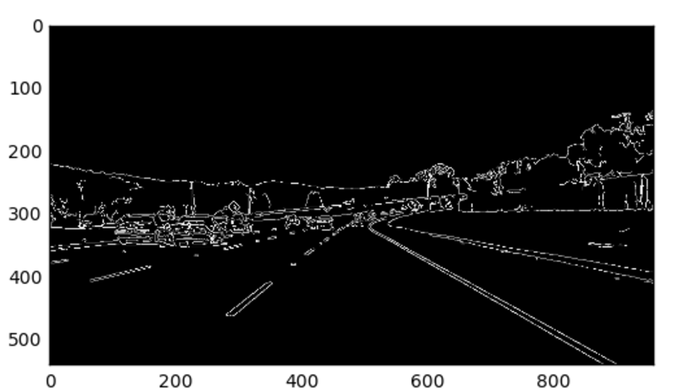
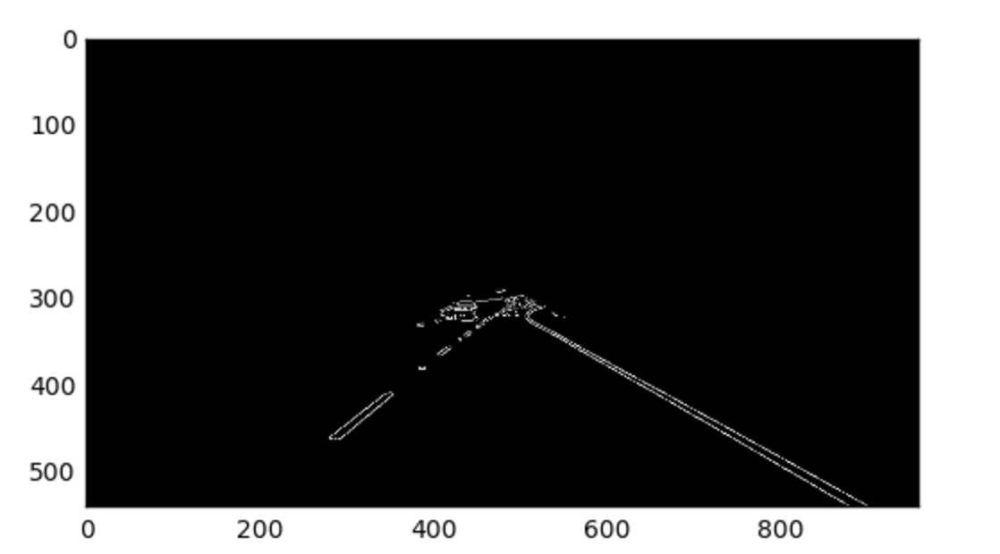
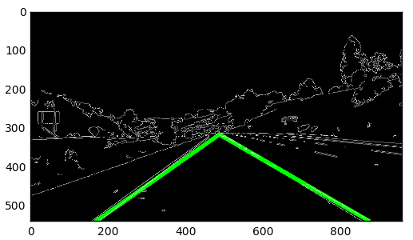

### Traffic Lane Lines Detection

The goals / steps of this project are the following:

#### 1)  Make a pipeline that finds lane lines on the road

Pipeline consisted of 4 steps:

1) Grey scale conversion, Gaussian Blur w/Kernel Size of 9 vs. 3. I did not find the parameters made that much difference; the biggest adjustment was in getting the ROI coordinates correct. Copied the parameters from the lecture videos.  Canny for edge detetion with 50,150. This results in a black background with white lines. The lane lines are in this image.

2) Apply ROI to canny with trapezoid shape. This is a hard coded shape and eliminates the lines which are not lane lines. This region of interest is a trapezoid: 
    [[(0,imshape[0]),(450,290),(490,290),(imshape[1],imshape[0])]], the image below is the same as the one above with the ROI applied. A result of applying the ROI is the set of lines with slopes corresponding to the right and left lanes are smaller to solve by visual inspection. In the first image there are 10s of line segments especially smaller ones near the horizon. Adding these lines at the horizon to the lane lines processing algorithm is a waste of processing power and hence a poor design choice. 

To quality check the dimensions; show all the test images with the trapezoid dimensions. Shows 1) the lanes are not obstructed, 2) there is a longest line segment for both right/left lines with a slope +/-.5 and shows the artifacts on the side and above the horizon are removed.  

3) calculate the lines in the above image using the proabilistic hough transform. Observe the left and right slopes. Filter into 2 lists and caculate average. Take longest segment and interpolate to where y=0 and calculate vanishing point. 

Algorithm for calculating vanishing point: 

y=mx+b for both left and right lines
bleft = yleft -mleft*xleft. Use the tuplepoints for x,y
bright = yright -mright*xright. Use the tuplepoints for x,y

equations foe lrft/right lane lines

yleft=mleft*xleft+bleft
yright=mright*xright+bright

bleft = yleft - mleft*xleft
bright = yright - mright*xright

the vanishing point is when yleft=yright=yvp and yright=xright=xvp

y_vp=mleft*x_vp+bleft
y_vp=mright*x_vp+bright

mleft*x_vp+bleft = mright*x_vp+bright
mleft*x_vp - mright*x_vp = bright - bleft
x_vp(mleft - mright) = bright - bleft

x_vp = (bright - bleft)/(mleft - mright)
y_vp = mright* x_vp + bright

The vanishing point represents the point on the horizon where anything above that should be filtered out. 

4)  Draw the lane lines using the interpolated/calculated vanishing point using 60% of the value from y=0 to the vanishing point. Adjust to smaller value as the car starts moving. Average lines together to prevent sudden jumps.

#### 2) Identify potential shortcomings with your current pipeline
the ROI is a static dimension. One shortcoming would be if a car was in front of the vehicle before the vanishing point. This would create more vertical and horizontal line artifacts. This problem would get worse with more cars. Also for situations like lane changes or u turns this method would not work well. 
These images are all daytime images. Another shortcoming are lines created from shadows or no edges in low light or if there is rain. 

#### 3) Suggest possible improvements to your pipeline
Improvement: add a dynamic ROI region. Compensate for traffic or cars to the side and in front of the camera. 

